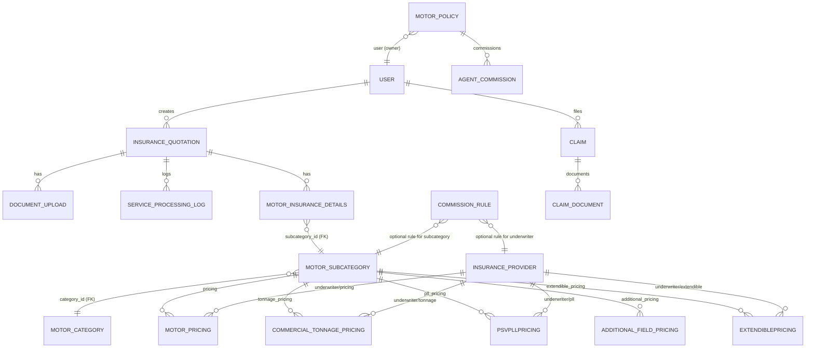

## Database schema overview

This file contains a compact ER diagram (Mermaid) representing the main tables involved in the Motor insurance flows and some adjacent models that reference them. It focuses on the entities used in the Motor2 system: quotations, motor details, categories, subcategories, pricing and policies.

### How to view
- If your Markdown renderer supports Mermaid (GitHub does for .md in the web UI), the diagram will render automatically.
- **PNG Export**: Open `docs/db-schema-viewer.html` in your browser and use screenshot tools or browser export features to save as PNG.
- Otherwise you can paste the Mermaid block into the Live Editor at https://mermaid.live or use VS Code Mermaid preview extensions.

### ER Diagram (Mermaid)



### Key tables and important fields

- `User` (auth user)
  - key: `id` (UUID)
  - fields: `phonenumber`, `email`, `role`

- `InsuranceQuotation`
  - key: `id` (UUID)
  - fields: `quotation_number` (unique), `insurance_type`, `form_data` (JSON), `dmvic_data` (JSON)

- `MotorInsuranceDetails`
  - key: `id` (UUID)
  - FK: `quotation` -> `InsuranceQuotation` (1:1)
  - FK: `subcategory` -> `MotorSubcategory` (PROTECT)

- `MotorCategory`
  - key: `id` (UUID)
  - fields: `code` (unique), `name`, business rule flags (requires_tonnage, requires_engine_capacity...)

- `MotorSubcategory`
  - key: `id` (UUID)
  - fields: `subcategory_code` (unique), `subcategory_name`, `product_type`, `pricing_model`, `additional_fields` (JSON)
  - FK: `category` -> `MotorCategory`

- `InsuranceProvider`
  - key: `id` (UUID)
  - fields: `name`, `code`, `display_mode`, `supported_categories` (JSON)

- `MotorPricing`, `CommercialTonnagePricing`, `PSVPLLPricing`, `AdditionalFieldPricing`, `ExtendiblePricing`
  - Each links `subcategory` -> `MotorSubcategory` and `underwriter` -> `InsuranceProvider`
  - Pricing configuration stored either as explicit fields (base_premium, bracket_pricing, tonnage_from/to) or as JSON blobs

- `MotorPolicy`
  - key: `id` (UUID)
  - fields: `policy_number` (unique), `user` (FK), `product_details` (JSON), `premium_breakdown` (JSON), `status`

- `CommissionRule` and `AgentCommission`
  - `CommissionRule` may reference `MotorSubcategory` and `InsuranceProvider` to set percent rates
  - `AgentCommission` links `agent` (User) to `MotorPolicy`

- `ServiceProcessingLog` and `DocumentUpload`
  - Logs external calls (DMVIC, TEXTRACT) and stores request/response JSON
  - `DocumentUpload.extracted_data` stores Textract results or other OCR output

### Special notes and cautions

- JSONFields: Several important business objects (quotations, pricing brackets, policy payloads) are stored as JSON. When drawing a strict relational model, treat these fields as semi-structured data; queries on nested keys may require JSONB indexing.

- MotorSubcategory.subcategory_code is unique and used across pricing and commission rules. During the recent reshuffle some duplicate codes existed in multiple categories; the repository contains a migration/management command (`app/management/commands/fix_subcategory_categories.py`) used to safely align subcategories.

- Foreign key behaviors:
  - `MotorInsuranceDetails.subcategory` uses on_delete=PROTECT to avoid accidental deletion of referenced subcategories.
  - Many pricing tables cascade on delete so be careful when removing subcategories (prefer deactivation).

### Verification checklist (recommended)

1. **Database Integrity Check**: Run Django inspectdb or `python manage.py showmigrations` and compare with this diagram.
2. **Foreign Key Verification**: Run queries to confirm foreign-key counts (e.g., pricing rows per subcategory) before any destructive changes.
3. **JSONB Indexing**: Add JSONB indexes on fields you query often inside JSONFields (e.g., `dmvic_data` -> certificateType) if Postgres is used (it is).
4. **Subcategory Cleanup Status**: Verify that the recent subcategory reshuffle completed successfully by running:
   ```bash
   python manage.py fix_subcategory_categories --dry-run
   ```
   Should return: "No issues found - database is already clean!"
5. **Referential Integrity**: Check for orphaned records or broken foreign key relationships:
   ```sql
   -- Example queries to run in PostgreSQL
   SELECT COUNT(*) FROM app_motorinsurancedetails WHERE subcategory_id NOT IN (SELECT id FROM app_motorsubcategory);
   SELECT COUNT(*) FROM app_motorsubcategory WHERE category_id NOT IN (SELECT id FROM app_motorcategory);
   ```

### Post-migration recommended actions

1. **Run Regression Tests**: Execute the full test suite to ensure Motor 2 flows work correctly:
   ```bash
   python manage.py test app.tests.test_motor2 -v 2
   python manage.py test app.tests.test_pricing -v 2
   ```

2. **Update Frontend Cache**: If frontend caches allowed subcategory lists, refresh them to match the new category alignment.

3. **Add Database Constraints**: Consider adding check constraints to prevent future cross-category subcategory insertion:
   ```sql
   -- Example constraint to enforce DMVIC certificate type alignment
   ALTER TABLE app_motorsubcategory ADD CONSTRAINT check_category_subcategory_alignment 
   CHECK (
     (category_id = (SELECT id FROM app_motorcategory WHERE code = 'PRIVATE') AND subcategory_code LIKE 'PRIVATE_%') OR
     (category_id = (SELECT id FROM app_motorcategory WHERE code = 'COMMERCIAL') AND subcategory_code LIKE 'COMMERCIAL_%') OR
     (category_id = (SELECT id FROM app_motorcategory WHERE code = 'PSV') AND subcategory_code LIKE 'PSV_%') OR
     (category_id = (SELECT id FROM app_motorcategory WHERE code = 'MOTORCYCLE') AND subcategory_code LIKE 'MOTORCYCLE_%') OR
     (category_id = (SELECT id FROM app_motorcategory WHERE code = 'TUKTUK') AND subcategory_code LIKE 'TUKTUK_%') OR
     (category_id = (SELECT id FROM app_motorcategory WHERE code = 'SPECIAL') AND subcategory_code LIKE 'SPECIAL_%')
   );
   ```

4. **Archive Deactivated Records**: Review and optionally purge deactivated duplicate subcategory rows (those with `is_active = False` from the migration).

5. **Monitor DMVIC Integration**: Test vehicle lookups to ensure certificate type mapping works correctly with the cleaned categories.

### Database backup information

- **Latest Backup**: `patabima_backup_before_subcategory_migration_20251016_112714.sql` (created before subcategory reshuffle)
- **Restore Command**: `psql -h 127.0.0.1 -p 5432 -U patabima_user -d patabima_insurance < patabima_backup_before_subcategory_migration_20251016_112714.sql`
- **Backup Schedule**: Consider setting up automated daily backups for production environments

### Next steps I can take for you

- Export a rendered PNG/SVG of the above Mermaid diagram and add it to `docs/`.
- Generate a full schema dump (tables, columns, indexes) for the database and include it in `docs/`.
- Produce a narrower diagram focused only on Motor pricing relationships showing unique constraints and sample field names.

---

File created: `docs/db-schema.md`
